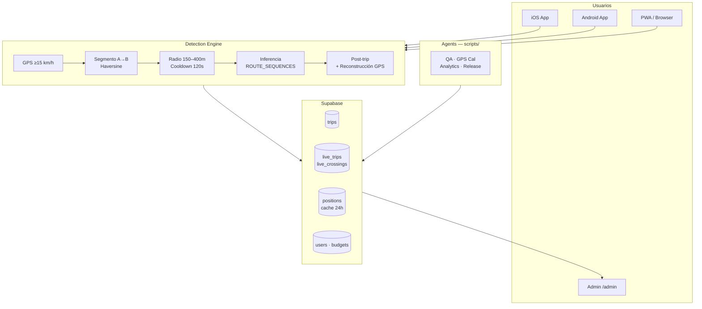

# TAGcontrol

Detección automática de peajes en autopistas de Chile. GPS en tiempo real, tarifas exactas, historial por conductor.

**PWA:** [tagcontrol.vercel.app](https://tagcontrol.vercel.app) · **App:** iOS + Android (Expo/EAS) · **Backend:** Supabase

---

## Arquitectura



---

## Estructura del repo

```
tag-control/
├── frontend/          # PWA — React 19 + Vite + Tailwind 4 (canonical)
│   └── src/
│       ├── data/tolls.json       # 80+ peajes con coords y tarifas
│       ├── lib/                  # lógica compartida con app/
│       ├── hooks/                # useGPS, useTrip
│       └── pages/                # Home, History, Settings, Admin
│
├── app/               # Nativa — React Native + Expo SDK 54
│   ├── app/(tabs)/               # Home, History, Settings (Expo Router)
│   └── src/lib/                  # locationService, liveTracking, auth
│
├── scripts/           # Agent layer
│   ├── analytics-agent.mjs
│   ├── code-review-agent.mjs
│   ├── gps-calibration-agent.mjs
│   ├── release-agent.mjs
│   └── check-shared-drift.mjs
│
├── docs/              # Manifiesto, brand assets
├── CLAUDE.md          # Contexto completo para desarrollo con Claude Code
└── ROADMAP.md         # Qué construimos y hacia dónde vamos
```

> **Shared logic:** `frontend/src/` es **canonical**. Los archivos de lógica (`tolls.json`, `pricing.js`, `inference.js`, `geoUtils.js`, `format.js`) son idénticos en `app/src/`. Metro (React Native) no resuelve imports fuera de `app/`, por eso están duplicados. Editar siempre en `frontend/` y sincronizar con `node scripts/check-shared-drift.mjs --fix`.

---

## Comandos rápidos

```sh
# PWA
cd frontend && npm run dev                    # dev server
cd frontend && npm run build                  # build → Vercel auto-deploy con git push

# App nativa
cd app && npx expo start                      # dev con Expo Go
cd app && npx eas-cli build --platform ios --profile production
cd app && npx eas-cli build --platform android --profile preview

# Agents
node scripts/check-shared-drift.mjs           # verifica sync frontend ↔ app
node scripts/check-shared-drift.mjs --fix     # sincroniza app/ desde frontend/
node scripts/code-review-agent.mjs --staged   # code review antes de commitear
node scripts/analytics-agent.mjs --days=7     # resumen semanal
node scripts/gps-calibration-agent.mjs --days=7  # propone calibraciones
node scripts/release-agent.mjs                # build Android + link descarga
```

---

## Stack

| Layer | Tech |
|---|---|
| PWA | React 19 · Vite · Tailwind 4 |
| App nativa | React Native · Expo SDK 54 · expo-location |
| Backend | Supabase (Postgres + Realtime + Auth) |
| Deploy PWA | Vercel (auto-deploy en git push) |
| Deploy App | EAS Build (iOS/Android) |
| Agents | Node.js scripts + Claude SDK |

---

## Detección de peajes — Pipeline

1. **GPS** — `BestForNavigation` (nativa) / `enableHighAccuracy` (PWA)
2. **Segment-based** — distancia al segmento A→B, no solo al punto GPS del peaje
3. **Speed + cooldown** — ≥15 km/h · 120s cooldown · `radio_deteccion_m` por peaje (150–400m)
4. **Inferencia real-time** — `inferMissingTolls()` detecta gaps en `ROUTE_SEQUENCES`
5. **Post-trip inference** — `inferPostTrip()` con timestamps via haversine / 90 km/h
6. **Reconstrucción GPS** — `reconstructFromPositions()` sobre cache de posiciones (24h)
7. **Persistencia** — `trips` INSERT siempre (0 peajes incluidos) + retry 3× con backoff

> Coordenadas verificadas con GPS real. No usar OSM como fuente de verdad — poco confiable en túneles.
